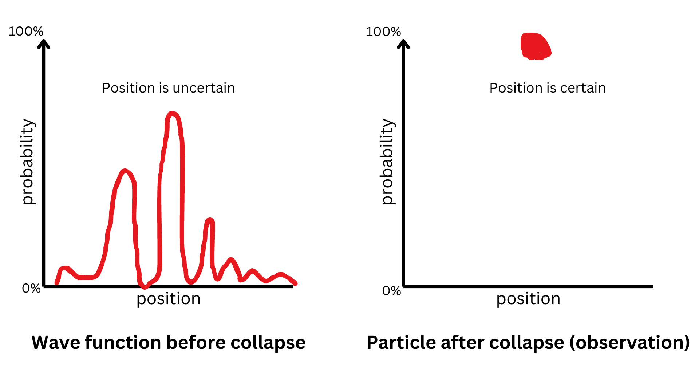
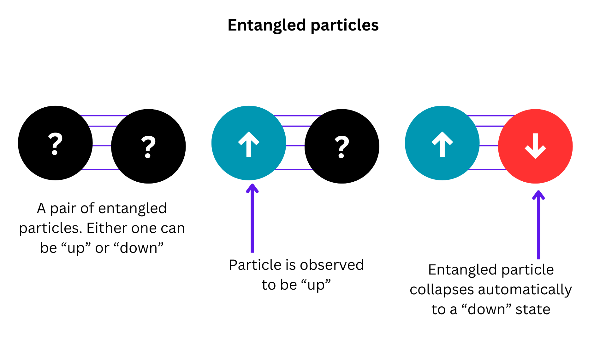
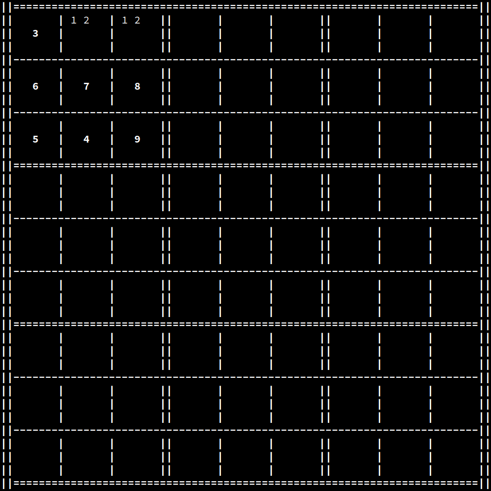
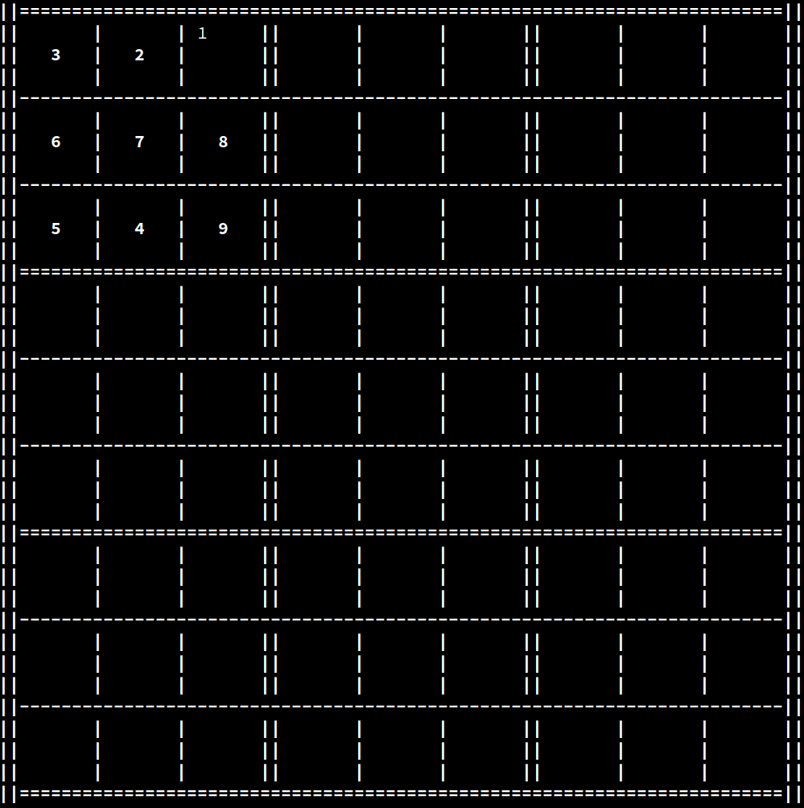
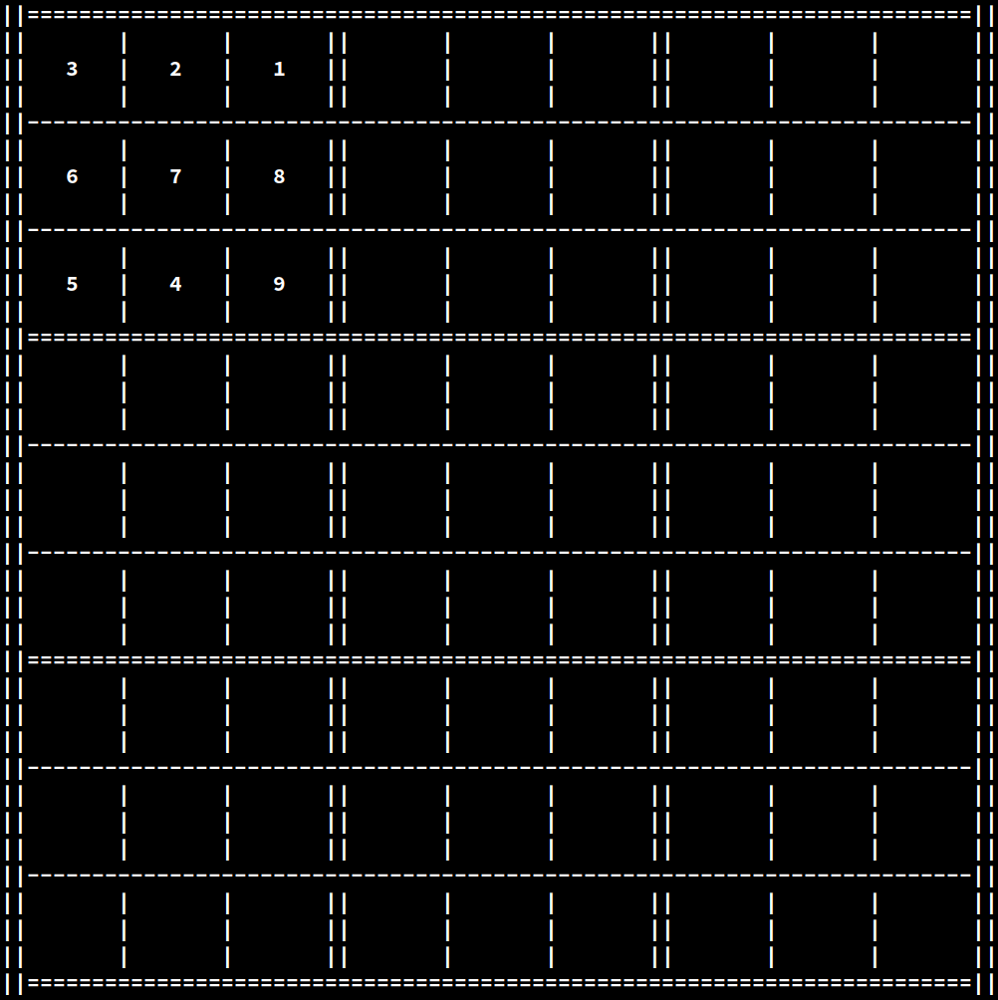
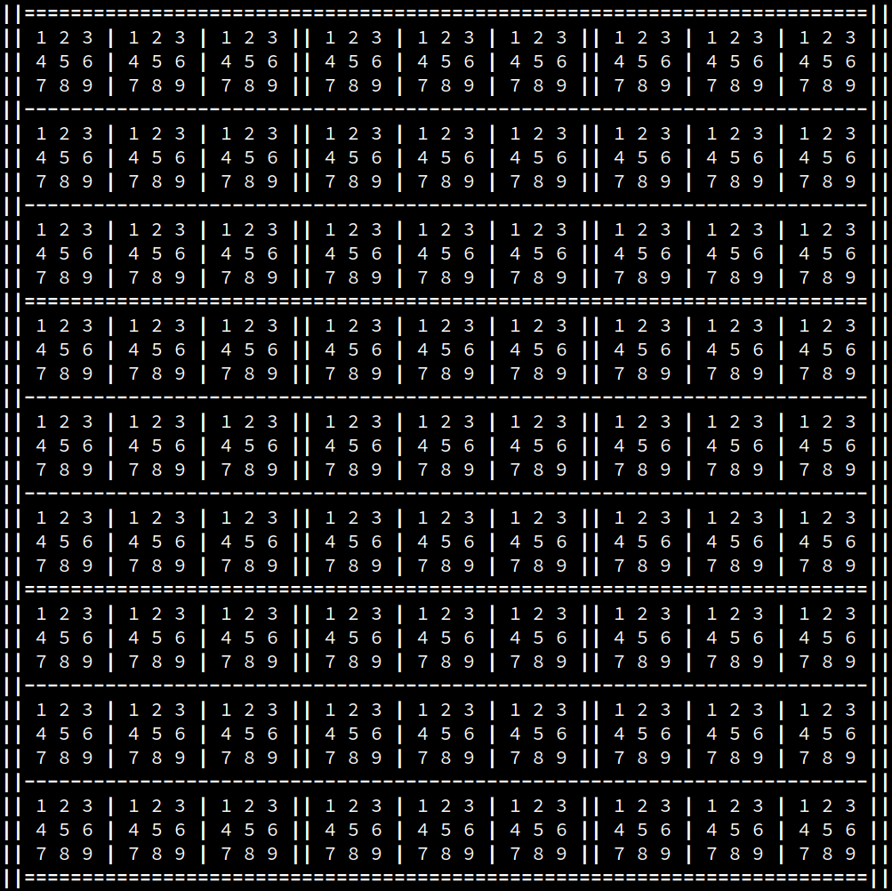
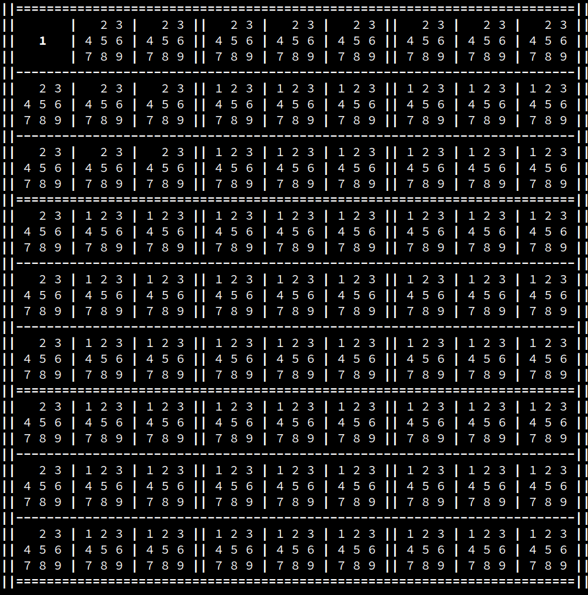
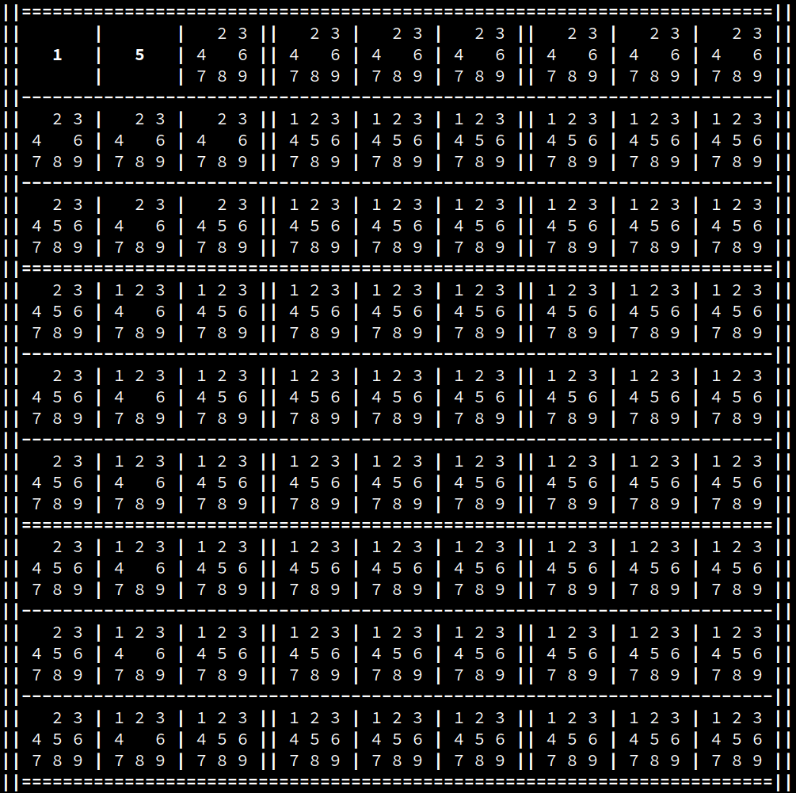
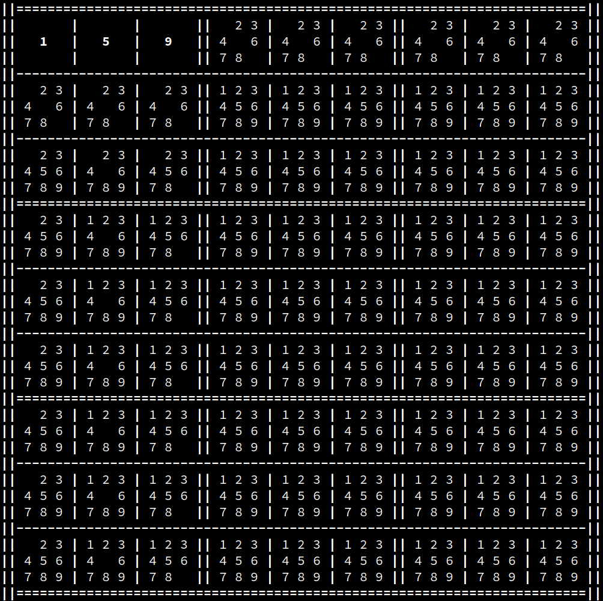

# Wave function collapse Sudoku solver

A Sudoku board solver and generator written in Rust.


- [Wave function collapse Sudoku solver](#wave-function-collapse-sudoku-solver)
  - [Basic usage](#basic-usage)
  - [Basic concepts](#basic-concepts)
    - [Wave function collapse](#wave-function-collapse)
    - [Wave functions in Sudoku](#wave-functions-in-sudoku)
- [How to generate a Sudoku board](#how-to-generate-a-sudoku-board)
  - [Procedural wave function collapse to generate a complete board](#procedural-wave-function-collapse-to-generate-a-complete-board)
  - [Procedural wave function collapse with uniqueness checks](#procedural-wave-function-collapse-with-uniqueness-checks)
- [How to solve a Sudoku board](#how-to-solve-a-sudoku-board)
  - [Wave function collapse with brute-force backtracking](#wave-function-collapse-with-brute-force-backtracking)
  - [Neighboring wave analysis with backtracking](#neighboring-wave-analysis-with-backtracking)
- [License](#license)


## Basic usage 

Generate a Sudoku board:
```bash
./run.sh gen
```

Generate a Sudoku board and solve it in-place:
```bash
./run.sh gen -s
```

Generate and save a Sudoku board to a file:
```bash
./run.sh gen -o <my_board>
```

View a saved Sudoku board:
```bash
./run.sh view <my_board>
```

Solve a saved Sudoku board:
```bash
./run.sh solve <my_board>
```

For more info on the command line interface, run with the `--help` flag:
```bash
./run.sh --help
```

## Basic concepts

Before we get to the algorithms, let's get familiar with the related concepts and data structures. 

### Wave function collapse

The wave function collapse algorithm is a technique inspired by quantum mechanics. In simple words, very small particles normally behave like probability waves. However, when the probability wave is observed, it collapses into a determinate particle.  



Furthermore, consider a pair of entangled particles. If the spin of one of them is measured, the spin of the other particle is automatically determined to be the opposite of its twin's. This means that the state of one particle is constrained by the state of the other.



Wave function collapse algorithms borrow from the concepts of quantum constraints and probability wave collapse by assigning a wave function to certain items. These wave functions are then procedurally collapsed into determinate states.  
Whenever an item's wave function collapses, the wave functions of entangled items are affected based on the constraints placed by the newly collapsed state. If, as a result of the previous collapse, an entangled wave function happens to have only one possible state, it collapses in turn, affecting other entangled wave functions in a chain reaction.

### Wave functions in Sudoku

In the case of Sudoku, the range of possible states a certain cell can assume is represented by a wave function. Such a wave function is dependent on the constraints put in place by the neighboring cells according to the rules of Sudoku.



In the example above, the second and third cells of the first row are entangled, meaning that either one collapsing results in the other automatically assuming the other value. Let's now say that the second cell collapses to a value of `2`:



At this point, the third cell of the first row must collapse to a value of `1`:



# How to generate a Sudoku board

Generating a valid Sudoku board with a unique solution is a two-phase process.

1. First, you generate a valid, completely filled board.
2. Then, you randomly clear a number of cells while still maintaining the uniqueness of the solution.

These two phases are described in detail below.

## Procedural wave function collapse to generate a complete board

This phase consists in generating a pseudo-random complete valid board.

1. First, a new board is generated with maximum entropy, meaning all cells can assume every possible state. 



2. Iterate through every cell, randomly collapsing each wave function and updating the neighboring cells accordingly as shown in the following exmaple:





If an invalid board configuration is reached, restart the generation process from step 1. Stop the process when a complete valid board is reached and go to the next phase.

## Procedural wave function collapse with uniqueness checks

After a complete board is generated in the previous phase, it's time to clear random cells to make the board playable. After all, a completely filled board is boring to play with.

1. Iterate over the board cells in random order. The random order is necessary to prevent iteration order artifacts from being observable in the resulting board.
2. For every cell, make it blank and try to see if the resulting board has a unique solution. If the solution is unique, just continue the iteration. If the solution is not unique, restore the cell's old state and continue the iteration.
3. If the number of cleared cells reaches the specified blank cell cap, which is the maximum number of blank cells you want your generated board to have, stop the iteration.

# How to solve a Sudoku board

Solving a Sudoku board can be a complicated task, especially if the given hints are few. This repository implements two techniques to solve valid Sudoku boards using algorithms based on wave function collapse.

## Wave function collapse with brute-force backtracking

This is one of the simplest algorithms to solve Sudoku boards.

1. First of all, we iterate throuch every cell of the given board and calculate the wave function at every cell, collapsing eventual single-state waves.  
2. Once we have all wave functions, we choose the cell with the lowest entropy. That is, the cell with the wave function that has the least possible states.  
3. At this point, we duplicate the current board and switch to the newly branched copy, where we randomly collapse one of the possible states of the aforementioned cell and propagate eventual wave function alterations to the neighboring cells. Continue solving this branch by repeating from step 2.
4. If we are able to solve the branch, unwind the backtracking and return the solved board. If the current branch is not solvable, backtrack to the previous configuration and collapse a different cell.

This algorithm is guaranteed to eventually find the correct board configuration, assuming the board is solvable, but it may take a long time since it tries every valid combination of states.

## Neighboring wave analysis with backtracking 

This is a more advanced algorithm that is guaranteed to find the correct board configuration in a short amount of time and using little memory, compared to the brute-force approach.

1. The first step is the same as the brute-force technique. We calculate the wave function of every cell, collapsing eventual single-state waves.
2. We then iterate through all the rows, columns, and 3x3 boxes. For every row, column, and 3x3 box, we search for a unique uncertain state. Because of Sudoku's rules, each row, column, and 3x3 box must contain every state exactly once. This means, for example, that, if a cell is the only one in its row that has the digit `9` as a possible state, then `9` is guaranteed to be the correct state of that cell because the row would otherwise have no `9` in it. If we find such a cell, we collapse the cell's wave function and propagate the changes to neighboring cells and continue solving.
3. If in the previous step no cell was updated, it means that we cannot deterministically solve this board by analyzing the neighboing wave functions. At this point, we do a brute-force backtracking step. We choose the cell with the lowest entropy, duplicate the current board configuration, randomly collapse the lowest entropy cell in the branched board and continue solving from step 2. If the branch results unsolvable, try collapsing the aforementioned cell with the next possible state and repeat.

# License

This repository and all its contents are licensed under the [MIT license](LICENSE).

